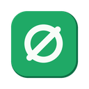

<div align="center">
  
  <h1>Shield-AdBlocker</h1>
  <p><strong>A lightweight, local-first content blocker for Chrome.</strong></p>
  <p>
    
    
    
    
    
  </p>
</div>

---

## Features

- **Blocks ads and trackers** — 95 network rules covering major ad networks, analytics pixels, and video-ad servers.
- **Blocks third-party cookies** — strips `Cookie` and `Set-Cookie` headers on cross-site requests.
- **Hides cookie banners** — covers OneTrust, Cookiebot, Quantcast/TrustArc, Osano, and common generic patterns.
- **Cleans up YouTube** — skips in-player ads and hides promoted placements without breaking playback.
- **Per-site pause** — one click pauses all protection for the current website.

Everything runs locally. No analytics, no accounts, no remote servers. See the [privacy policy](PRIVACY_POLICY.md).

## Install

1. Download or unzip this folder.
2. Open `chrome://extensions` and enable **Developer mode**.
3. Click **Load unpacked** and select this folder.
4. Pin Shield from the puzzle-piece menu.

The compiled `.js` files are included — no build step is needed to install.

## Usage

The toolbar popup provides:

| Control | Effect |
|---|---|
| Master switch | Turns all protection on or off |
| Feature toggles | Ads & trackers, third-party cookies, YouTube, cookie banners, ad-space cleanup |
| **Pause here** | Suspends network and cosmetic filtering for the current website |
| Badge counter | Requests blocked on the active tab |

Settings and the site allowlist are stored in your local browser profile.

## Development

Requires Node.js and npm (only for modifying the source).

```bash
npm install              # one-time setup
npm run build            # compile TypeScript to JavaScript
npm run generate-rules   # regenerate rules/*.json from the domain list
npm test                 # run release-safety tests
npm run release          # build, test, validate, and create the store ZIP
```

To add a blocked domain, edit `AD_AND_TRACKER_DOMAINS` in
[tools/generate-rules.js](tools/generate-rules.js) and run `npm run generate-rules`.
Edit `.ts` files only — the `.js` files are generated.

## Project structure

```
manifest.json        Manifest V3 configuration
background.ts        Service worker: rulesets, allowlist, badge
popup/               Toolbar popup UI
content/             Cosmetic filtering and page-state scripts
rules/               Generated declarativeNetRequest rule files
tools/               Rule generation, validation, and packaging scripts
store-assets/        Chrome Web Store listing copy and images
website/privacy.html Hostable privacy-policy page
```

## Known limitations

- **Third-party cookie blocking is broad by design** and can affect embedded sign-in or payment widgets — use **Pause here** on affected sites.
- **Cookie-banner hiding is best-effort**; sites without a recognized consent platform may still show banners.
- **YouTube markup changes over time**, so its selectors may need occasional updates.
